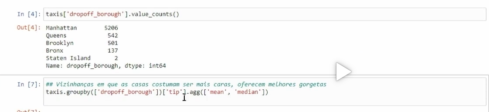

#BIBLIOTECAS

##Numpy - calculos de forma estruturada - base para o pandas - array
    Base para outras bibliotecas
    Array sempre um tipo de dados
    Varias otimizações para os calculos e gera mais economia computacional
    No array no print não mostra as virgulas
    Matriz - array com mais de uma dimensão
    notas.max() - demonstra o maximo do array
    notas.min() - demonstra o minimo do array
    notas.std() - desvio padrão
    notas.mean() - média
    notas.argmin() - posição do menor

    Mascaras booleana - 
        Realizar mascara boleana para identificar sequencias simples ou compostas, nas quais podem separar o interesse na pesquisa.
        Filtragem de dados - 

##Pandas - dados em formato tabular - analise de dados, aprendizado de maquina
    ###Pandas series - 
        Conjunto de dados de uma dimensão, parecido com o array do numpy, pode optar por Indice usada atraves de chaves como se fosse um dicionário
        Colocar series em dicionário facilida a interpretação, pois os dados ficam ligado ao indice(nome)
    ###DataFrames
        df = pd.DataFrame(dicionario) - transforma o dicionario criado é um dataframe(tabela)
        Pode realizar operações de filtragens, através dos indices dos dicionários.
        Exemplo: Filtra dicionário pelo nome dos autores dos livros.
        Pode adicionar dados - df.append(Adiciona todos os dados )
        Versão 2.2.2 do Pandas não possui função de append em Dataframes.
        Para realizar ajustes no nome de algo que foi definido no dicionário faz uma mascara definindo o que vc quer alterar  e posteriormente usa o comando:
            df.loc[mascara_correcao,'Titulos'] = 'Mémorias'
        Para realizar a busca com data frame especifico para um item do dicionário, deve usar o código abaixo:
            df[df['Autores'] == 'Rick']['Titulos']
    ###Analise de dados
        
        Os dados a imagem primeiro faz a busca na base de dados das cidades que mais tem contagens.
        Depois ele realiza uma analise atraves das gorgetas, pela media e mediana com os codigos especificos.

##Matpotlib - grafica

##Skilearn - Aprendizado de maquina, inteligencia artificial, previsões e classificações.

