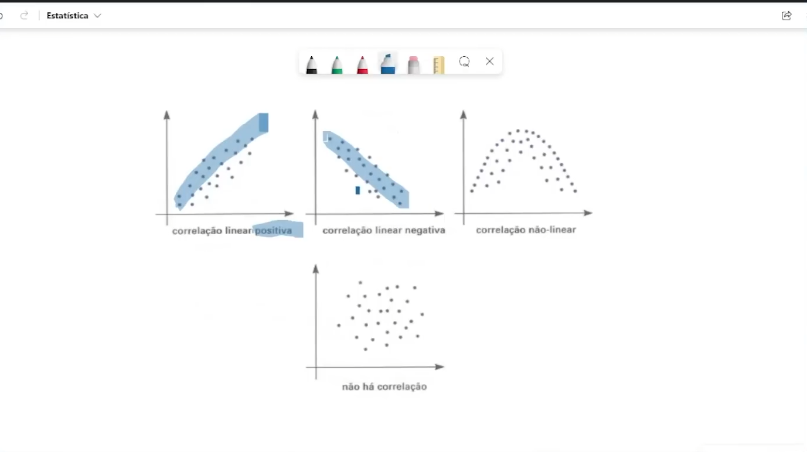

# ESTATISTICA

## Conceito
    Metodos de coletas, analise, organização, descrição e interpretação dos dados.

    ### Divisão
        Descritiva - organização e descrição dos dados
        Probabilidade - situações que envolvam o acaso
        Inferência  - Analise e interpretação dos dados.

    ### Amostragem
        Subconjuntos de uma população
        Amostras probabilistica - Probabilidade maior que zero - 
            Aleatoria simples - 
                Com reposição elemento sorteado mais de uma vez.
                Sem reposição so uma vez.
            Estratificadada - grupos de caracteristicas comum e amostra aleatória desse estratos.
            Sistematica - regra pre definida - ex: Quando definimos uma coleta de 900 casas para 50, realiza uma razão pela divisão do total pela amostra e sorteia a iniciale vai aplicando as razões sequencialmente.
            Conglomerado - dividida em miniaturas não homogeneas e seleciona amostra aleatoria desse conglomerados. Ex: Bairros, quarterões, Comunidade. Renda familiar de uma cidade.
        Amostra não probabilistica -não ha probabilidade clara - acidental, intencional e por cotas.
## Tipos de Variáveis
    Qualitativos: 
        - Nominais - Cor dos olhos: são nominais - não tem ordem - sexo: Masculino ou Feminino
        - Ordinais - Tem ordenação - Escolaridade; Nivel de satisfação
    Quantitativos:
        - Discretos - Quando tem que ser inteiro e não meio. Jogar um dado.
        - Continuos - Assume qualquer valor, produção.

## Construção de tabela
    Titulo, corpo, cabeçalho, colunas, casas ou celulas, linha, coluna e rodapé
    

    Frequencia Relativa
        Quando divide a frequencia pelo total dos dados. Para achar percentual, multiplica por 100.
    Intervalos de classe:
        |- conta o primeiro e não conta o ultimo.
    Ponto médio - Valor central do intervalo - Final menos inicial / 2
## Visualização de dados
    Graficos de linhas - frequencia no decorrer do tempo
    Graficos de Coluna - frequencia de algum dado categorico
    Graficos de barra - Frequencia um pouco maior - pode ser horizontal e vertical
    Graficos de setores - pizza - poucas categorias - participação do dado no total
    Histograma - Area é a soma das frequencias
    Diagrama de caixas ou boxplot - quartis
    Grafico de dispersao - graficos onde relaciona duas variáveis para analise delas
## Medidas de posição e dispersão
    Posição:
        Moda - O que acontece com maior frequencia - pode ser modal, bimodal ou amodal
        Media - Soma as frequencias e divide pelo total das amostras - tomar cuidado por valores discrepantes
        Mediana - Se for impar é a posição central quando ordenados - quando é par, pega a media dos dois numero centrais.
        Quartis - Dividir em quatro partes iguais - mediana segundo quartil, Primeiro quartil é a mediana da primeira divisão, Terceiro quartil é a mediana da segunda divisão
        Percentis - 100 partes iguais - p25 = q1; p50=q2=mediana; p75=q3
    Dispersão
        Amplitude total - onde começa até onde termina - final menos inicial
        Variância - S² = Somatorio((xi - x')²)/n ; x' = media; n = numero de elementos 
        Desvio Padrão = raiz da variância populacional ; amostral divide por n-1
## Analise Bidimensional
    Similaridades entre as variáveis
        Duas variaçoes podem ser qualitativas
        Duas variações podem ser quantitativas
        Uma quali e outra quantitativa
        
        Coeficiente de correlação de pearson = 
## Regressão Linear Simples
    
    Coeficiente de correlação  - quanto mais proximo de 1  mais forte ela é.
## Derivadas - probabilistico
    Deterministico -  valor sempre o mesmo
    Não deterministico - valor altera - depende do acaso. Quanto mais feito, mais padrões são encontrados.
    Espaço amostral - resultados possíveis de um experimento
    Evento - subconjunto do espaço amostral. Distingue um evento do outro.

